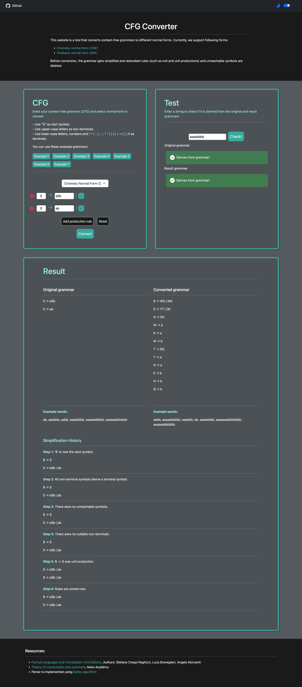
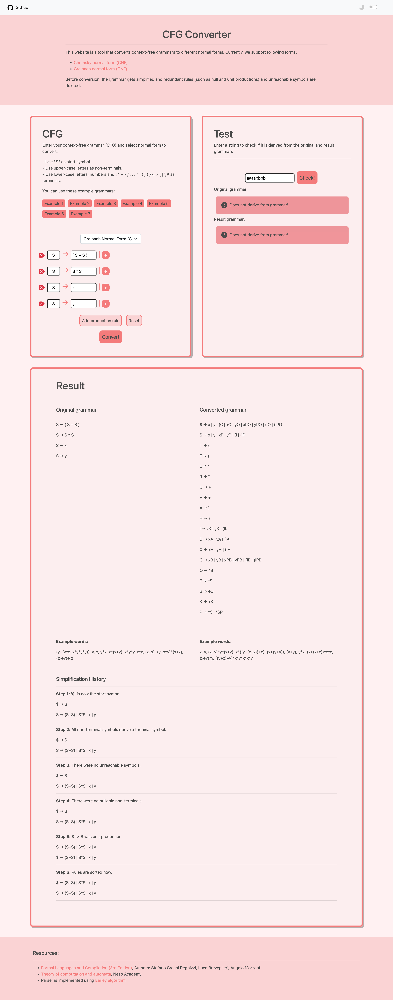

# cfg-converter
General converter for context free grammars. 

## demo

live demo: http://mahshidhp.pythonanywhere.com

## Installation

run this command in root folder of project
```bash
pip3 install -r requirements.txt
```
run this command in root-folder/client 
```bash
npm install
```

## Usage

### run server:
run this command in root folder of project
```bash
python3 server.py
```

### run front-end:
run this command in root-folder/client 
```bash
npm start
```
this will open up a browser tab on http://localhost:3000 running the project

## Screenshots





